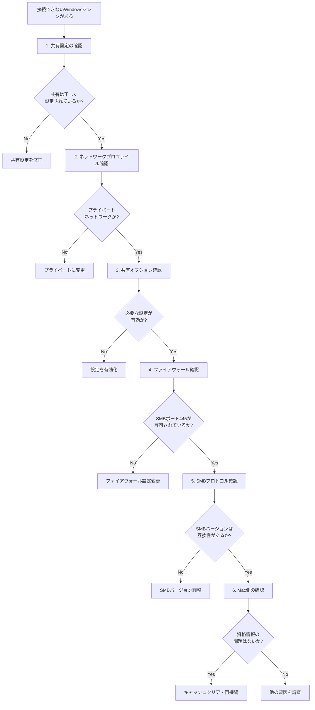

# Windows共有フォルダMac接続トラブルシューティング

## 前提条件

- 同じネットワーク内の他のWindowsマシンには接続可能
- 特定のWindowsマシンのみ接続できない
- ネットワーク自体は正常に機能している

---

## トラブルシューティング フローチャート



---

## 詳細確認手順（優先度順）

### ✅ 1. Windows側の共有設定確認

### 確認項目

- [ ] フォルダが共有状態になっているか
	- エクスプローラーで対象フォルダを右クリック
	- 「プロパティ」→「共有」タブで確認
- [ ] 共有権限が正しく設定されているか
	- 「共有」タブ→「詳細な共有」→「アクセス許可」
	- アクセスするユーザーまたはグループが含まれているか確認
- [ ] NTFS権限が正しく設定されているか
	- 「セキュリティ」タブで確認
	- 共有権限とNTFS権限の両方が必要

### 注意点

⚠️ 「Everyone」のみの権限設定は、パスワード保護共有が有効な場合アクセスできない可能性あり

→ 明示的にWindowsアカウント名を指定する

---

### ✅ 2. ネットワークプロファイルの確認

### 確認手順

1. 「設定」→「ネットワークとインターネット」
2. 接続中のネットワークをクリック
3. ネットワークプロファイルを確認

### 設定項目

- [ ] 「プライベートネットワーク」に設定されているか
	- パブリックネットワークの場合、共有制限が厳しくなる

---

### ✅ 3. 共有の詳細設定確認

### 確認手順

1. 「コントロールパネル」→「ネットワークと共有センター」
2. 「共有の詳細設定の変更」をクリック
3. 「プライベート」プロファイルの設定を確認

### 必須設定

- [ ] **ネットワーク探索**：有効
- [ ] **ファイルとプリンターの共有**：有効
- [ ] **パスワード保護共有**の設定確認
	- 有効：Mac側でユーザー名/パスワード認証が必要
	- 無効：ゲスト接続が許可される（セキュリティリスクあり）

### 比較確認

💡 接続できる他のWindowsマシンと設定を比較する

---

### ✅ 4. ファイアウォール設定確認

### 確認項目

- [ ] Windows Defenderファイアウォールの設定
	- 「設定」→「プライバシーとセキュリティ」→「Windowsセキュリティ」
	- 「ファイアウォールとネットワーク保護」
- [ ] SMB通信（ポート445）が許可されているか
	- 「詳細設定」→「受信の規則」
	- 「ファイルとプリンターの共有」関連ルールが有効か確認

### トラブルシューティング手順

1. 一時的にファイアウォールを無効化（安全なネットワークでのみ）
2. 接続テストを実施
3. 接続できた場合、ファイアウォールルールを調整
4. サードパーティセキュリティソフトも同様に確認

---

### ✅ 5. SMBプロトコルバージョンの確認

### 確認項目

- [ ] Windows側のSMBバージョン設定
	- 「コントロールパネル」→「プログラム」→「Windowsの機能の有効化または無効化」
	- 「SMB 1.0/CIFS ファイル共有のサポート」の状態を確認

### 注意点

⚠️ **SMB 1.0はセキュリティリスクあり**（使用非推奨）

✅ SMB 2.0/3.0での接続を推奨

### 対処方法

- Windows・Mac両方がSMB 2.0以上をサポートしているか確認
- プロトコルバージョンの不整合がないか検証

---

### ✅ 6. Mac側のクライアント設定確認

### 資格情報キャッシュのクリア

1. 「キーチェーンアクセス」アプリを起動
2. 該当サーバーのIPアドレスまたはホスト名で検索
3. 古いエントリを削除

### 接続方法の変更

- [ ] ホスト名ではなくIPアドレスで直接接続を試す
	- Finder →「移動」→「サーバへ接続」
	- `smb://192.168.x.x` の形式で入力

### 接続手順

```
smb://[ユーザー名]:[パスワード]@[IPアドレス]/[共有名]
```

---

## チェックリスト（優先順）

|優先度|確認項目|確認場所|
|---|---|---|
|🔴 高|共有設定・権限|Windows：共有フォルダのプロパティ|
|🔴 高|ネットワーク探索・ファイル共有|Windows：共有の詳細設定|
|🟡 中|ファイアウォール（ポート445）|Windows：セキュリティ設定|
|🟡 中|ネットワークプロファイル|Windows：ネットワーク設定|
|🟢 低|SMBプロトコルバージョン|Windows：機能の有効化/無効化|
|🟢 低|資格情報キャッシュ|Mac：キーチェーンアクセス|

---

## 参考情報

### 使用Windowsバージョンの確認方法

1. `Win + R`キーを押す
2. `winver`と入力してEnter
3. バージョン情報が表示される

### よくある原因

- 共有権限とNTFS権限の設定漏れ
- ファイアウォールによるSMBポートのブロック
- ネットワークプロファイルが「パブリック」になっている
- 古い資格情報のキャッシュ

---

💡 **次のステップ**: 具体的なWindows画面操作手順（スクリーンショット付き）が必要な場合は、使用しているWindowsのバージョンをお知らせください。